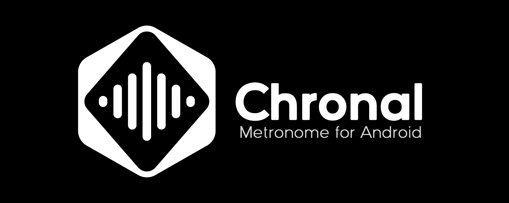
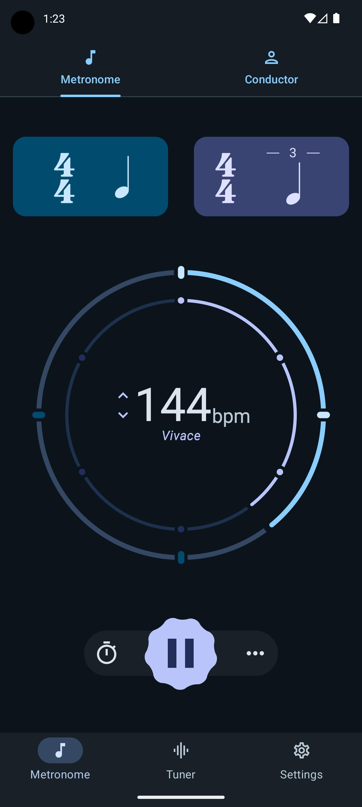
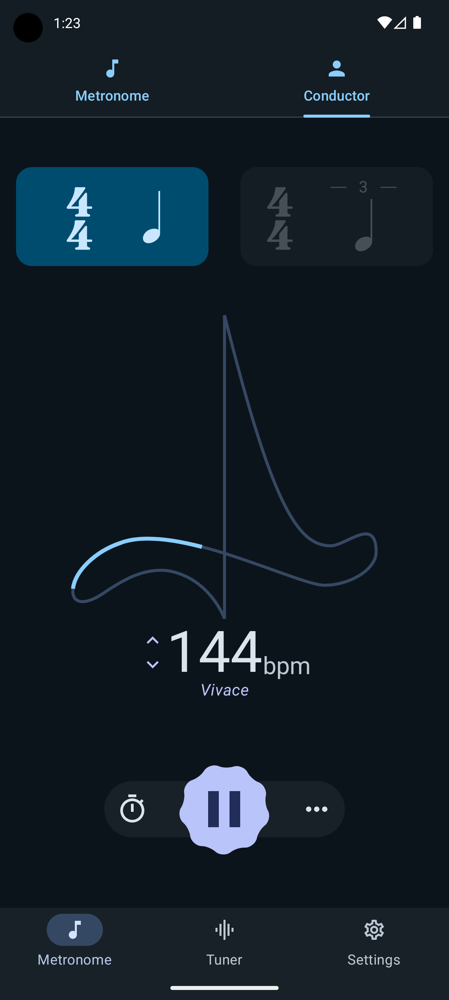
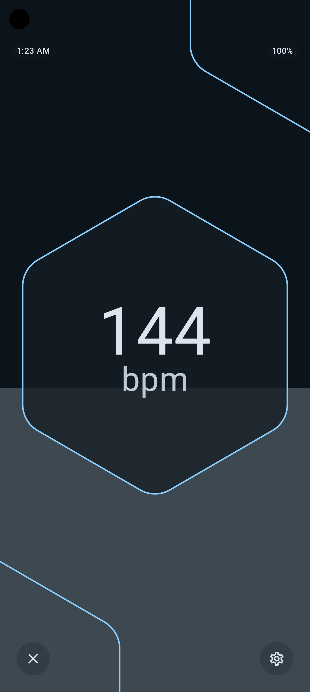
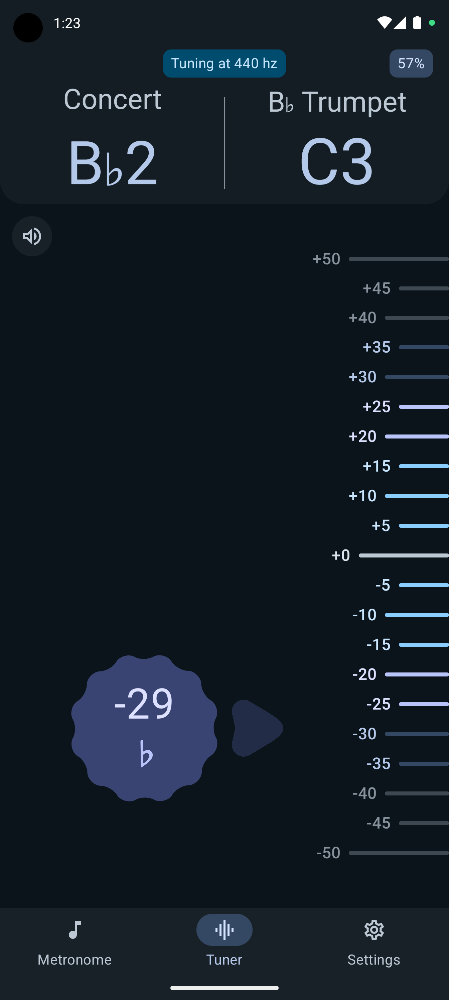
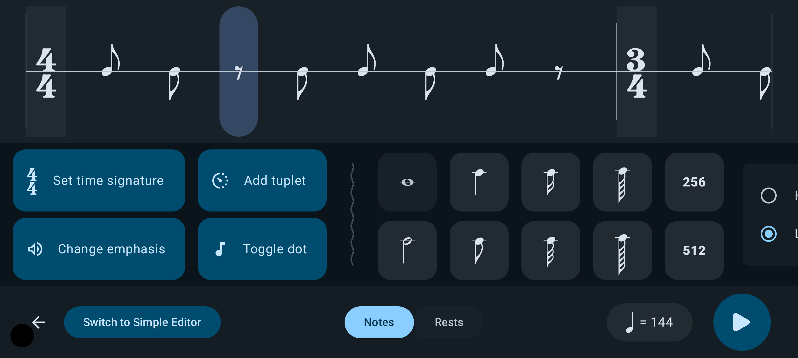

# Chronal
Chronal is a metronome and tuner app for Android made for beginner and advanced musicians. 

## Features

### Metronome
* Beat visualization
* Two synchronized metronomes for polyrhythms
* Conductor mode with metronome and tuner
* Notation editor for creating custom rhythms
* Fullscreen mode for easy peripheral viewing
* Seven custom sound packs (with more to come!)

### Tuner
* Tuner with pitch detection
* Real-time BPM detection from microphone
* Transpose to any instrument
* Custom tuning to any frequency
* A4 tuning reference audio

## Screenshots

