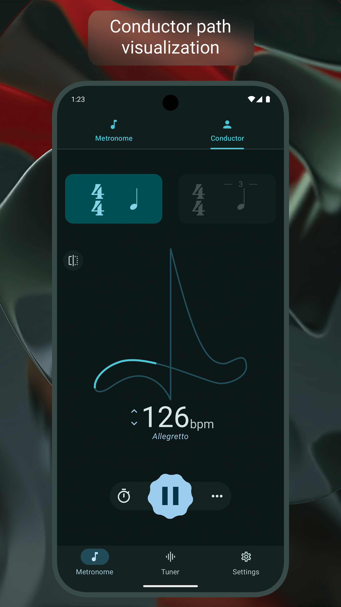
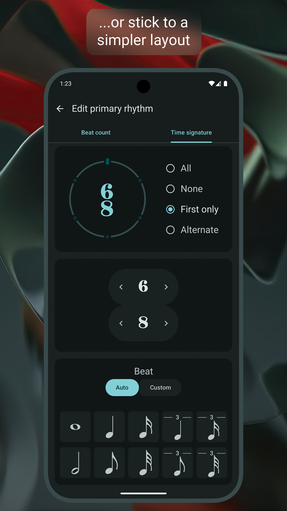

# Chronal
Chronal is a metronome and tuner app for Android made for beginner and advanced musicians. 

## Features

### Metronome
* Beat visualization
* Two synchronized metronomes for polyrhythms
* Conductor mode with metronome and tuner
* Notation editor for creating custom rhythms
* Fullscreen mode for easy peripheral viewing
* Seven custom sound packs (with more to come!)
* Play audio files with custom tempos

### Tuner
* Transpose to any instrument
* Custom tuning to any frequency
* Tuner graph
* Real-time BPM detection from microphone
* A4 reference tone
* Custom A4 frequencies

## Screenshots

  
   
  

